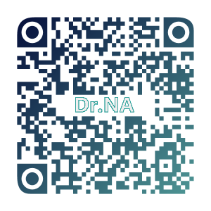
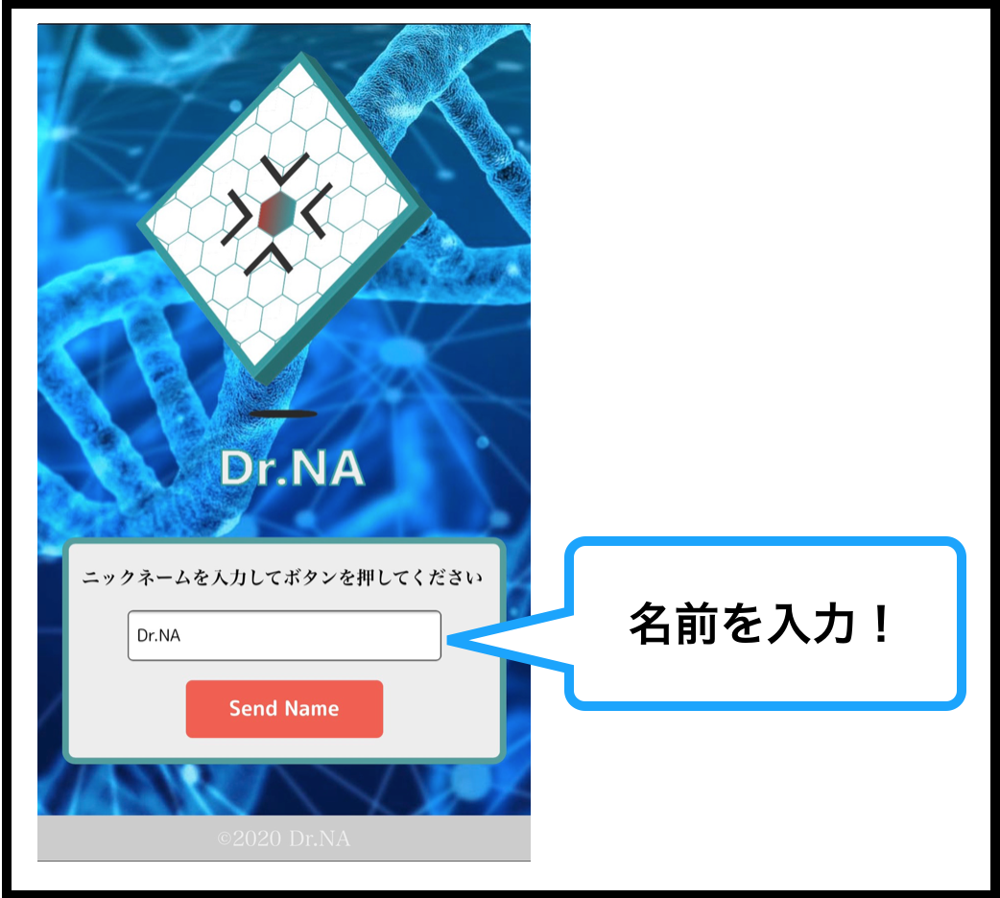
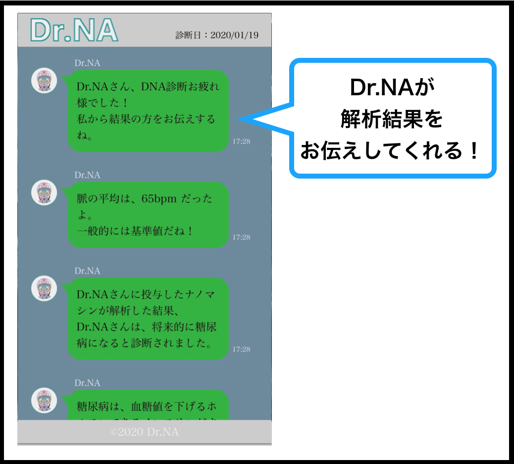

# Dr.NA_ResultFront

name : Masakatsu Shibata

こちらは使用者向けのREADME になります。 
開発に関しては、<a href="../README.md">README</a> を参照してください。

## ■ アプリケーションの説明

まず初めにDr&#46;NA のメインシステムから解析をします。 
解析後こちらのアプリケーションにアクセスしますとDr&#46;NA が解析結果をお手持ちのデバイスで解説してくれます。

## ■ アクセス

- URL

  https://misotarozamurai.github.io/Dr.NA_ResultFront/

- QR

  

## ■ 使い方

### １. ニックネーム(名前)を入力してください

- 下記画面の入力フォームにてニックネーム(名前)を入力してください。 
入力をした後、ボタンを押してください。

  

### １. Dr&#46;NAが診断結果を解説します

- Dr&#46;NAが診断した結果をお伝えしてくれます。

  

&copy;2020 Dr.NA_ResultFront
